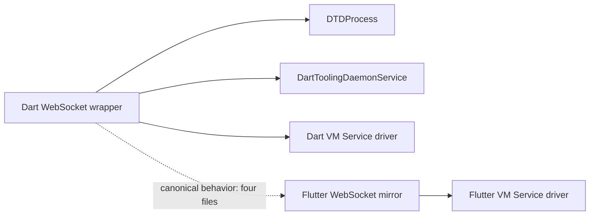

# WebSocket Architecture in the Dart and Flutter IntelliJ Plugins

This document records the accepted WebSocket architecture, the judgment behind it, and the rules that AI agents and contributors must preserve when changing DTD or VM Service communication.

---

## 1. Objectives and Summary

The Dart and Flutter IntelliJ plugins use a small, plugin-owned wrapper around the JDK's `java.net.http.WebSocket`.

### Key Intentions and Design Decisions

- **Permanent internal boundary:** Plugin WebSocket consumers use the wrapper, not the JDK WebSocket directly. The wrapper began as a migration-compatible replacement for Weberknecht, but it is now the permanent place for shared transport mechanics.
- **JDK implementation:** The JDK client is preferred because it satisfies the plugins' needs without adding an external dependency that must be packaged, upgraded, and kept compatible with the IntelliJ Platform and Kotlin runtime.
- **Transport-only scope:** The wrapper handles WebSocket mechanics. DTD and VM Service code retain ownership of JSON-RPC, request IDs, authentication secrets, service registration, readiness, logging, and product lifecycle.
- **Text-only protocol:** Current consumers exchange complete JSON text messages. Binary and streaming application payloads are out of scope.
- **Shared behavior:** The wrapper centralizes receive demand, text-fragment reassembly, automatic ping/pong behavior, send serialization, lifecycle coordination, bounded waits, and transport-error normalization.
- **Portable implementation:** The wrapper stays JDK/Kotlin-only and Java-friendly. It must not depend on IntelliJ APIs, Gson, coroutines, or DTD/VM Service types.
- **Cross-repository parity:** Dart is the canonical implementation for the four wrapper files. Flutter mirrors their behavior for its VM Service driver, with only package and import differences.

---

## 2. Context and Decision

### Why Weberknecht Was Replaced

The plugins previously bundled Weberknecht 0.1.5. It was old and effectively unmaintained, and keeping a bundled client library created continuing ownership and packaging work.

More importantly, Weberknecht did not automatically answer WebSocket Ping frames with Pong frames. DTD is launched with a ping interval, so a client that does not implement the control-frame exchange can lose an otherwise healthy connection. The JDK implementation automatically replies to Ping and Close frames as required by the protocol.

### Why Use a Wrapper Instead of the JDK API in Every Consumer

Using `java.net.http.WebSocket` directly in DTD and VM Service code would distribute transport-specific behavior across several protocol implementations. Every consumer would need to understand and correctly reproduce:

- the JDK's asynchronous connection and send APIs;
- receive-demand accounting through `WebSocket.request(long)`;
- fragmented text buffering and complete-message delivery;
- the prohibition on overlapping text sends;
- timeout, cancellation, interruption, close, and error behavior; and
- automatic control-frame handling.

The wrapper also made the original migration low risk. `DTDProcess`, `DartToolingDaemonService`, and the Java VM Service driver could retain the Weberknecht-shaped interaction model and change mostly imports. This was particularly valuable at the Java/Kotlin boundary.

The exact legacy-shaped helper types are not permanent public API. Coordinated internal cleanup is allowed, but the shared boundary and its behavioral guarantees must remain.

### Why the JDK Client Was Chosen

OkHttp was evaluated as the strongest representative of external WebSocket libraries. Its API and testing tools are capable, but the plugins do not need interceptors, HTTP caching, custom connection-pool tuning, or similar advanced HTTP features for their modest JSON-RPC traffic.

An external client also creates ongoing dependency work:

- aligning transitive Kotlin versions with the IntelliJ Platform;
- excluding or reconciling duplicate standard-library artifacts;
- updating and auditing the dependency;
- packaging it correctly in both plugins; and
- keeping Dart and Flutter builds aligned.

The JDK client avoids that maintenance cost and is already available in every supported IDE runtime. An external WebSocket client should be reconsidered only when a demonstrated product requirement or correctness issue cannot reasonably be satisfied by the JDK implementation.

### Rejected Alternatives

| Alternative | Decision |
| :--- | :--- |
| Keep Weberknecht | Rejected because of maintenance risk, bundled-JAR overhead, and missing automatic Ping/Pong handling. |
| Use the JDK client directly in each consumer | Rejected because it duplicates subtle transport mechanics and couples DTD/VM Service code to the JDK listener and future APIs. |
| Add OkHttp or another external client | Rejected because its extra capabilities do not justify dependency, compatibility, and packaging maintenance. |

---

## 3. Architecture and Ownership

### Dart Locations

- The canonical wrapper is in [the Dart WebSocket package](../../third_party/src/main/java/com/jetbrains/lang/dart/websocket/).
- Dart consumers are [DTDProcess](../../third_party/src/main/java/com/jetbrains/lang/dart/dtd/DTDProcess.kt), [DartToolingDaemonService](../../third_party/src/main/java/com/jetbrains/lang/dart/ide/toolingDaemon/DartToolingDaemonService.kt), and the [VM Service driver](../../third_party/src/main/java/com/jetbrains/lang/dart/ide/runner/server/vmService/vmServiceDrivers/service/).

### Flutter Mirror

Flutter carries the corresponding four files under:

    third_party/vmServiceDrivers/org/dartlang/vm/service/internal/websocket/

The mirrored files are:

- `WebSocket.kt`
- `WebSocketEventHandler.kt`
- `WebSocketMessage.kt`
- `WebSocketException.kt`

Their behavior and implementation bodies must stay aligned with Dart. Package declarations and imports differ intentionally.

The Dart SDK removed its Java VM Service implementation and generator as technical debt. The plugin copies are therefore maintained directly rather than refreshed from the SDK. The Dart copy is plugin-owned source under `third_party/src/main/java/com/jetbrains/lang/dart/ide/runner/server/vmService/vmServiceDrivers/`, outside the upstream-managed `thirdPartySrc` tree. This document declares Dart canonical only for the four WebSocket files; it does not establish a synchronization policy for the rest of the VM Service driver.

Behavioral WebSocket changes are made and validated in Dart first. After a Dart pull request exists, use the repository's `port-pr` workflow to carry the change to Flutter, compare the four implementations, and run Flutter's VM Service integration test. The overall cross-plugin change is not complete until parity is verified.

---

## 4. Wrapper Responsibilities and Invariants

### API Boundary

- All DTD, VM Service, and equivalent future plugin consumers must go through the shared wrapper.
- Do not expose `java.net.http.WebSocket`, its listener, or its futures to protocol code.
- Keep the API straightforward to call from both Java and Kotlin.
- The wrapper is an internal source-level boundary, not a binary compatibility promise to third-party plugins.
- Add only the smallest transport-neutral capability required by a real consumer. Do not turn the wrapper into a mirror of the complete JDK API.

Features such as handshake headers, subprotocols, or custom TLS configuration may be added when a concrete consumer requires them. They belong behind transport-neutral wrapper APIs rather than being exposed through the raw JDK builder.

### Connection Lifecycle

- Create one wrapper instance for one URI and one connection attempt.
- Install the event handler before calling `connect()`; open and early message callbacks may arrive immediately.
- A failed or closed connection is terminal for that wrapper instance. The owner creates a new wrapper for a later attempt.
- The wrapper does not perform retries, reconnection, backoff, or process restart.
- The underlying `HttpClient` is shared by default so connections reuse its threads and transport resources.
- `close()` is idempotent and must remain safe when racing with sends and transport callbacks. A racing send may fail cleanly, but closing must not corrupt state or resurrect the socket.
- Owners perform their own shutdown cleanup and must not depend on a local `close()` producing an immediate `onClose()` callback.
- Consumers own protocol-ready state such as `webSocketReady`; the wrapper only reports transport open and terminal events.

### Sending

- One `send(text)` call represents one complete text message.
- Concurrent callers are supported, but outgoing text sends must never overlap.
- Serialize sends and preserve the resulting serialization order. The current lock is an implementation choice; mutual exclusion and ordering are the behavioral requirements, not lock fairness.
- Surface synchronous send failures through the wrapper exception and retain the original cause.

The JDK rejects a new text or binary send while a previous data send is pending. Central serialization prevents each consumer from independently implementing this rule and keeps JSON-RPC messages intact.

### Receiving, Demand, and Fragmentation

- Request effectively unlimited listener invocations when the connection opens. This keeps JDK demand accounting inside the wrapper and avoids repeated `request(1)` bookkeeping.
- This choice favors implementation simplicity and is appropriate for the plugins' modest DTD/VM Service traffic. It is not a claim that the consumer can apply backpressure.
- Accumulate text fragments until the JDK marks the final fragment, then emit exactly one complete `WebSocketMessage`.
- Never expose partial JSON text to consumers.
- JDK listener callbacks for one socket are sequential, so the per-connection fragment buffer does not need its own lock.
- RFC 6455 prevents fragments from two data messages from interleaving unless a relevant extension is negotiated. Control frames may occur between data fragments, but they do not modify the text buffer.
- Large, fragmented VM Service messages are supported. The peers are trusted and messages are expected to be reasonable, so the wrapper intentionally has no arbitrary text-size cap.
- Binary application messages are unsupported and must not be added without a concrete requirement and regression coverage.

### Ping and Pong

- Automatic reciprocal Pong handling is an architectural invariant.
- The JDK implementation automatically sends the reciprocal Pong; consumers must not manually send a second Pong from the callback.
- Retain `onPing()` and `onPong()` callbacks for observation and future keepalive diagnostics. They do not transfer responsibility for protocol replies to consumers.
- Any replacement transport must demonstrate equivalent automatic behavior, including a DTD connection that remains healthy across server ping intervals.

### Threading

- Event-handler callbacks run directly on JDK transport threads.
- Handlers may perform bounded parsing and dispatch inline.
- Blocking work, long-running computation, IntelliJ read/write actions, and UI updates must be handed off to an appropriate executor or the EDT as required.
- Do not block a transport callback while waiting for work that depends on another callback from the same socket.

The current `connect()`, `send()`, and `close()` implementations wait on JDK futures. Those waits are bounded, but they can still freeze the IDE. Do not call these methods on the IntelliJ Event Dispatch Thread. When changing an existing EDT path, move WebSocket I/O to a background context or evolve the wrapper toward an asynchronous API.

The blocking facade was chosen to preserve Weberknecht behavior and simplify migration; it is not a permanent architectural requirement. A future asynchronous API is allowed if it retains lifecycle, ordering, Java interoperability, and error guarantees across every consumer and both repositories.

### Errors, Timeouts, and Logging

- Synchronous operations normalize JDK and future failures into `WebSocketException` and preserve the original cause.
- Consumers own contextual logging because they know the URI, operation, request, and appropriate severity. The wrapper must not acquire an IntelliJ logging dependency.
- Connection, send, and close waits must be bounded while the facade remains blocking.
- The current 10-second values are defensive implementation defaults, not stable API contracts.
- A blocking implementation must cancel failed/timed-out futures where appropriate and restore the thread interruption flag after catching `InterruptedException`.
- The current listener maps a post-connect JDK `onError` to the terminal `onClose()` signal. Richer error reporting is an allowed future improvement, but is not an unrelated-change TODO.

---

## 5. Consumer Responsibilities and Non-Goals

DTD and VM Service layers remain responsible for:

- parsing and generating JSON-RPC;
- request and response correlation;
- DTD trusted-client secrets and registered services;
- deciding when the protocol is ready;
- logging contextual failures;
- disposing processes and project services; and
- scheduling work on IntelliJ threads and executors.

The wrapper intentionally does not provide:

- JSON-RPC abstractions;
- binary or streaming application messages;
- automatic reconnect or retry;
- an application-level message queue;
- HTTP caching or interceptors;
- protocol authentication or secret management;
- a general connection-state model; or
- automatic EDT dispatch.

---

## 6. Rules for Future Changes

Before changing WebSocket code:

1. Read this document and identify every Dart and Flutter consumer affected.
2. Confirm that the requirement belongs in the transport wrapper rather than DTD or VM Service protocol code.
3. Check whether any touched caller can run on the EDT.

While implementing:

1. Change the Dart wrapper first.
2. Preserve the JDK/Kotlin-only and Java-friendly boundary.
3. Preserve text reconstruction, automatic Ping/Pong behavior, send serialization, close race safety, and error causes.
4. Add the smallest shared capability needed; do not expose raw JDK transport types.
5. Add a focused regression test for the behavior being changed.

Before considering the work complete:

1. Run all Dart WebSocket-related integration tests.
2. Port behavioral changes to the four Flutter wrapper files.
3. Compare Dart and Flutter implementations after accounting for package/import differences.
4. Run Flutter's VM Service integration test.
5. Update this document if the change revises an architectural decision or invariant.

Do not introduce an external WebSocket dependency or use the JDK WebSocket directly in a consumer without deliberately revisiting this ADR and documenting the missing JDK capability that justifies the change.

---

## 7. Test Requirements

Every behavioral wrapper change requires a focused regression test and the existing real-process integrations.

### Dart Integration Tests

From the Dart IntelliJ repository root, with a Dart SDK configured as required by the integration test workflow:

    ./gradlew test --tests "com.jetbrains.dart.dartToolingDaemon.DTDProcessTest" --tests "com.jetbrains.dart.dartToolingDaemon.DartToolingDaemonServiceTest" --tests "com.jetbrains.dart.vmService.VmServiceTest"

These cover:

- DTD connection establishment and round-trip requests;
- concurrent DTD requests and serialized transport use;
- DTD service initialization messages; and
- VM Service connection, version negotiation, requests, and stream subscription.

### Flutter Integration Test

After porting the four wrapper files, run the test from the Flutter IntelliJ repository root, with a real Flutter SDK configured through `FLUTTER_SDK` or `FLUTTER_ROOT`:

    ./gradlew integration --tests "io.flutter.integrationTest.vmService.VmServiceTest"

### Focused Regression Scenarios

Choose scenarios relevant to the change, including:

- fragmented and large text messages are delivered once and complete;
- concurrent sends do not overlap or corrupt JSON;
- connect, send, and close failures retain causes and do not leak state;
- interruption restores the interrupted flag;
- local and remote closure leave the wrapper terminal;
- close racing with send fails safely; and
- automatic Ping/Pong keeps DTD connected beyond its configured ping interval.

A dedicated Ping/Pong regression should be added when feasible, either by keeping DTD alive beyond its ping interval or by using a controllable test server.

---

## 8. References

- [JDK 21 WebSocket API](https://docs.oracle.com/en/java/javase/21/docs/api/java.net.http/java/net/http/WebSocket.html)
- [RFC 6455: The WebSocket Protocol](https://www.rfc-editor.org/rfc/rfc6455)
- [Dart SDK issue #63939: migrate the Java VM Service client from Weberknecht](https://github.com/dart-lang/sdk/issues/63939)
- [Dart SDK change 531301: remove the Java implementation and generator](https://dart-review.googlesource.com/c/sdk/+/531301)
- [Dart PR #433: introduce the JDK wrapper for DTDProcess](https://github.com/flutter/dart-intellij-third-party/pull/433)
- [Dart PR #516: migrate VM Service](https://github.com/flutter/dart-intellij-third-party/pull/516)
- [Dart PR #579: remove the remaining Weberknecht artifact](https://github.com/flutter/dart-intellij-third-party/pull/579)
- [Flutter PR #9060: replace Weberknecht](https://github.com/flutter/flutter-intellij/pull/9060)
- [Flutter PR #9065: align the wrapper with Dart](https://github.com/flutter/flutter-intellij/pull/9065)
