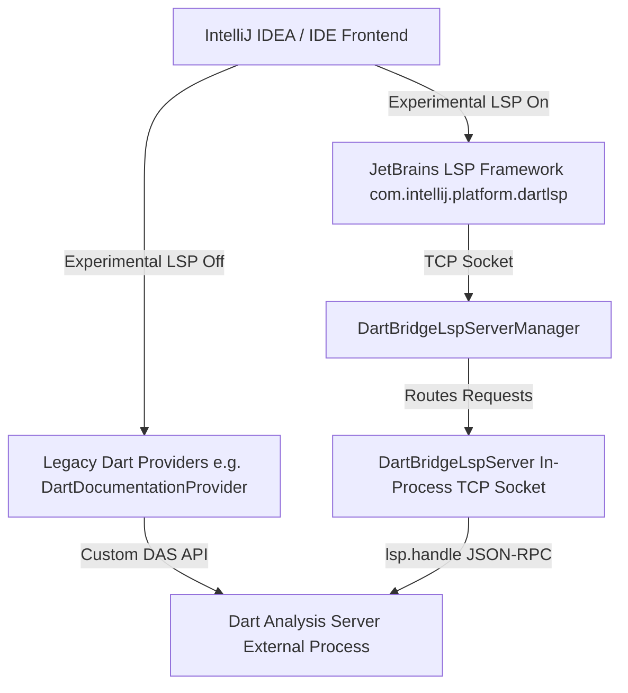

# Migrating Dart Analysis Server Features to JetBrains LSP

This skill provides comprehensive architectural context, guidelines, and step-by-step instructions for converting legacy Dart Analysis Server (DAS) features (such as hover, navigation, diagnostics, code completion, etc.) over to the JetBrains LSP integration.

---

## 1. High-Level Architecture

The Dart IntelliJ plugin operates under a hybrid architecture during the transition from custom DAS protocols to the Language Server Protocol (LSP):



### The Bridge Server Architecture
JetBrains' native LSP client expects to connect to a socket or standard I/O stream speaking JSON-RPC 2.0. Because the Dart Analysis Server (DAS) is already running as a standalone process managed by `DartAnalysisServerService`, we do not launch a second LSP server process.
Instead, `DartBridgeLspServerManager` hosts a lightweight in-process TCP socket bridge (`DartBridgeLspServer`). When the JetBrains LSP framework sends an LSP request (e.g., `textDocument/hover`), `DartBridgeLspServer` wraps the LSP payload into a custom DAS request named `lsp.handle` (`{ "lspMessage": <jsonrpc payload> }`), forwards it to DAS, and unpacks the returned `lspResponse` back to the JetBrains LSP framework.

---

## 2. Critical Nuances & Guidelines

> [!IMPORTANT]
> **Copied JetBrains LSP Client Sources (`com.intellij.platform.dartlsp`)**
> To support IntelliJ Platform versions 2025.3 and 2026.1 before JetBrains' official Ultimate LSP client becomes open source in Community Edition, the platform LSP framework was copied into `third_party/thirdPartySrc/platform-lsp/` under the namespace `com.intellij.platform.dartlsp`.

When working with or modifying LSP features, adhere to these rules regarding copied platform code:
1. **Avoid Major Structural Changes**: Do not make arbitrary or major structural refactorings inside `third_party/thirdPartySrc/platform-lsp/`. We anticipate dropping this directory entirely and migrating to JetBrains' official open-source platform code in the future.
2. **Automate Necessary Patches**: If a modification to the copied platform code is strictly required (for example, removing the `ProjectFileIndex.isInContent` check in `LspServerImpl.kt` so external library files in `.pub-cache` or `dart:io` receive LSP hovers), you **must** codify the fix inside `.agents/skills/patch-copied-lsp-sources/scripts/patch.py`. This ensures the change persists automatically whenever upstream LSP sources are re-synchronized.
3. **Upstream Porting Evaluation**: Whenever custom patches are required in copied platform code, evaluate whether the change should be proposed as an upstream feature request or pull request to `intellij-community` so the future transition is seamless.
4. **DAS Client Capability Handshake (`RequestUtilities.java`)**: Unlike `platform-lsp/`, files inside `third_party/thirdPartySrc/analysisServer/com/google/dart/server/` (such as `RequestUtilities.java`) are custom Java client wrapper utilities maintained locally in this repo. Direct modifications to `RequestUtilities.java` (e.g., setting `"linkSupport": true` on `textDocument.definition` or `textDocument.typeDefinition` when enabling LSP features) are **expected and required** and do not require `patch.py`.

### Document Synchronization Nuance
Standard LSP servers rely on `textDocument/didOpen`, `didChange`, and `didClose` notifications to maintain file state. However, in our architecture, document synchronization is already handled globally and synchronously by the legacy `DartAnalysisServerService` (`das.updateFilesContent()`). 
Therefore, `DartBridgeLspServer` intentionally ignores LSP `didOpen`/`didChange` payloads. **However**, the JetBrains frontend LSP client must still register files as "opened" internally (via `LspOpenedFilesService` and `openForOpenedOrUnsavedFiles()`) so UI features like quick documentation target providers know an active server exists for the file.

### Functional Trade-offs & Edge Case Scope Differences
Switching from a custom legacy DAS UI provider to standard JetBrains LSP features can sometimes result in subtle behavioral changes or minor loss of custom functionality (for example, custom interactive buttons or specialized text formatting present in legacy tooltips that aren't natively supported by standard LSP Markdown renderings).
* **Documenting Trade-offs**: Always explicitly document any functional differences, behavioral changes, or UI regressions in pull request descriptions and migration notes so stakeholders clearly understand what is changing.
* **Edge Case Scope Differences**: JetBrains' built-in LSP client assumptions often differ from Dart's project model. For example, during the **Hover Migration**, LSP hover initially only worked on files inside project content roots (`bin/main.dart`), whereas legacy DAS hover worked on external files in `.pub-cache` and Dart SDK libraries (`dart:io`). This occurred because upstream JetBrains hardcoded an `isInContent` check. Always actively test edge cases—such as external library files, injected code fragments, and scratch files—when converting a feature.

---

## 3. Pre-Migration Discovery & Baseline Walkthrough

Before writing any code to replace an analysis feature with LSP, perform a thorough baseline evaluation:
1. **Prompt for Visual Proof**: Ask the user to provide screenshots or screen recordings demonstrating the existing legacy feature in action (e.g., what the hover tooltip looks like, how code lens items are displayed, or how navigation behaves).
2. **Trace Legacy Implementation**: Walk through and document how the current legacy feature operates end-to-end. Identify the entry point in `com.jetbrains.lang.dart.*`, which specific `DartAnalysisServerService` methods are invoked, how the DAS response is parsed, and how the UI element is constructed.
3. **Establish Acceptance Criteria**: Compare the legacy capabilities against standard LSP spec capabilities to define clear acceptance criteria and identify any expected differences upfront.

---

## 4. Step-by-Step Feature Migration Guide

When migrating a legacy DAS feature (e.g., Go To Definition, Rename, Diagnostics) to LSP, follow this systematic workflow:

### Step 1: Identify & Gate the Legacy Provider
Locate the existing IntelliJ provider implementing the feature using DAS (e.g., `DartDocumentationProvider.java` or `DartRenameHandler.java`).
Gate the legacy logic behind the experimental LSP feature flag so that when experimental LSP is enabled, the legacy provider yields control (returns `null` or `false`):
```java
if (DartConfigurable.isExperimentalLspFeaturesEnabled(element.getProject())) {
  return null; // Let JetBrains native LSP client handle this request
}
```

### Step 2: Enable Feature Customization in Descriptor
Open [DartLspServerDescriptor.kt](../../../third_party/src/main/java/com/jetbrains/lang/dart/lsp/DartLspServerDescriptor.kt) and update `lspCustomization` to enable the feature when the setting is toggled on:
```kotlin
override val hoverCustomizer: LspHoverCustomizer
    get() = if (DartConfigurable.isExperimentalLspFeaturesEnabled(project)) {
        LspHoverSupport()
    } else {
        LspHoverDisabled
    }
```
*(Note: Replace `hoverCustomizer` / `LspHoverSupport` with the appropriate customizer property for your feature, such as `goToDefinitionCustomizer`, `renameCustomizer`, etc.)*

### Step 3: Advertise Capability in Bridge Handshake
Open [DartBridgeLspServer.kt](../../../third_party/src/main/java/com/jetbrains/lang/dart/lsp/DartBridgeLspServer.kt) and update the `initialize()` method to declare support for the feature in `ServerCapabilities`:
```kotlin
override fun initialize(params: InitializeParams): CompletableFuture<InitializeResult> {
    val capabilities = ServerCapabilities().apply {
        setHoverProvider(true)
        // Set your feature capability here (e.g., setDefinitionProvider(true))
    }
    return CompletableFuture.completedFuture(InitializeResult(capabilities))
}
```

### Step 4: Forward Request in `DartBridgeLspServer`
Implement or override the corresponding LSP4J service method in `DartBridgeLspServer.kt` and forward it via `forwardRequest()`:
```kotlin
override fun hover(params: HoverParams): CompletableFuture<Hover> {
    return forwardRequest("textDocument/hover", params, Hover::class.java)
}
```
`forwardRequest()` automatically packages the parameters into an `lsp.handle` JSON-RPC request and registers a pending `CompletableFuture`. When DAS responds asynchronously, `handleDasResponse()` resolves the future.

---

## 5. Testing & Verification Checklist

1. **Clean Build & Sandbox Run**:
   Always verify changes in a clean sandbox IDE instance:
   ```bash
   ./gradlew clean prepareSandbox --no-build-cache
   ```
2. **Dynamic & Startup File Verification**:
   Test the feature both on files that are open during IDE initial startup, and on files opened dynamically after startup (including external dependencies in `.pub-cache` or `dart:io`).
3. **Settings Toggle Lifecycle**:
   Verify that toggling **Settings | Languages & Frameworks | Dart | Enable Experimental LSP features** cleanly stops and restarts the bridge server without leaving hanging sockets or corrupted state.
4. **Plugin Verifier Baselines**:
   Run `./gradlew verifyPlugin`. If verification baselines change, run `third_party/tool/update_baselines.sh` to ensure copied LSP client issues remain filtered out.
