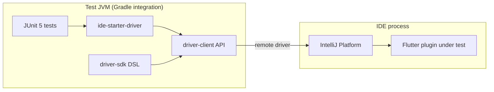

# Architecture: test JVM, IDE process, and driver

## Two processes

| Process | Role |
|---------|------|
| **Test JVM** | Runs JUnit 5 (`integration` Gradle task). Your `@Test` methods call IDE Starter and the driver API. |
| **IDE process** | Real IntelliJ / Android Studio instance with the Flutter plugin installed. UI, PSI, and actions run here. |

The driver sends commands to the IDE (via the stack IDE Starter sets up — remote driver / JMX / Rd as implemented by the bundled `driver-client` and platform) and returns results to the test.

## Artifact map

- **`ide-starter-driver`**: download/unpack IDE, install plugins from `path.to.build.plugin`, VM options, **`runIdeWithDriver()`**, **`BackgroundRun`** lifecycle.
- **`driver-sdk`**: ergonomic Kotlin API built on top of the client (`invokeAction`, `Finder`, `ideFrame`, common dialog components, etc.).
- **`driver-client`**: `Driver` interface — `service()`, `withContext` / `withReadAction` / `withWriteAction`, screenshots, `exitApplication()`, etc.
- **`driver-model`**: types shared across wire protocol (e.g. **`RdTarget`**).

## Threading and actions

Platform code in the IDE is sensitive to **threading** (EDT vs background). The driver exposes explicit dispatch:

- **`withContext(OnDispatcher, LockSemantics, …)`** — run a block on a chosen dispatcher with correct lock semantics.
- **`withReadAction` / `withWriteAction`** — read/write action wrappers as used by IntelliJ.

Use **`OnDispatcher.EDT`** when the underlying API requires the event dispatch thread (typical for Swing UI).

Details and parameters: see [driver-api.md](driver-api.md).

## `RdTarget` (remote development / multi-process)

`com.intellij.driver.model.RdTarget` is an **`enum`** with:

- **`DEFAULT`**
- **`FRONTEND`**
- **`BACKEND`**

Use the appropriate target when calling `Driver.service(…, rdTarget)` (and related APIs) so commands hit the correct side in **Remote Development** or split front/back scenarios. For local single-process IDE tests, **`DEFAULT`** is typical.

`Driver.isRemDevMode()` reflects whether remote-dev semantics apply.

## Screenshots and lifecycle

`Driver.takeScreenshot(...)` runs in the IDE; failures can surface as test errors if the IDE or hierarchy is not ready — see [agent-playbook.md](agent-playbook.md).

`BackgroundRun.closeIdeAndWait()` (IDE Starter) tears down the IDE process; pair with `@AfterEach` / `@AfterAll` as in this repo’s tests.
